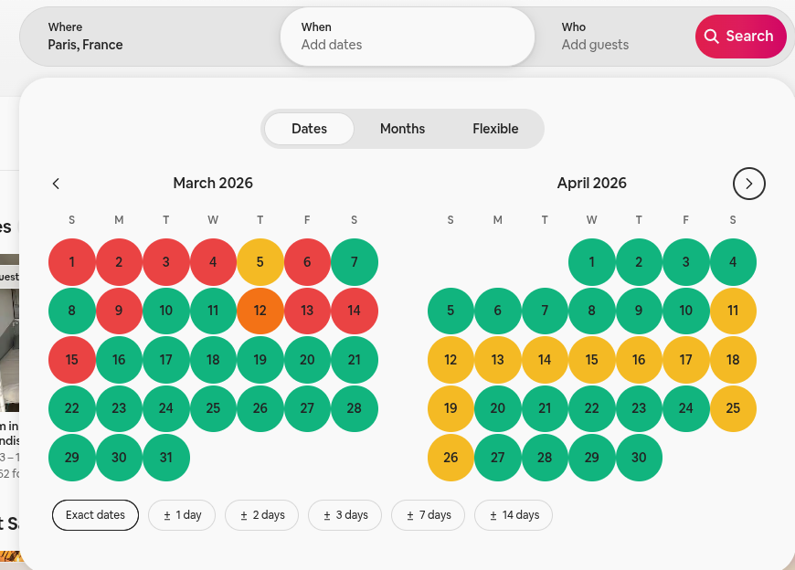

## What it does

A nightly-price model for Airbnb listings, delivered through a Chrome extension. While you browse, it estimates what a listing *should* cost and uses seasonal patterns to show whether it's a good deal.

## Features

**Prediction overlay.** The extension reads the listing you're viewing and asks the backend for a predicted price. It then shows the prediction next to the actual price, so overpriced listings stand out.

**Stoplight calendar.** A SkyScanner-style calendar colors each day green, yellow, orange or red, based on historical prices from about 1 billion calendar data points. That makes cheaper booking windows easy to spot.

## How it's built

**Data and training (Databricks).** All processing and training ran in Databricks notebooks using PySpark:

- `main` covers data cleaning, transformations, the ML pipeline, training and evaluation.
- `extract_calendar` collects Inside Airbnb calendar download links and merges them into one dataset.
- `poi_scraping` scrapes train station and airport locations to enrich the features.
- `save_model` saves the model and its artifacts to DBFS.

**Model artifacts.** The production model is a gradient-boosted tree regressor. It ships with fitted imputers, a scaler, location clusters, city- and cluster-level median prices, and calendar data. Everything is stored in Azure Blob Storage.

**Serving.** A Flask API loads the Spark model and serves predictions, backed by a SQLite database of listings. The Chrome extension (content script, overlay and popup) calls this API.
